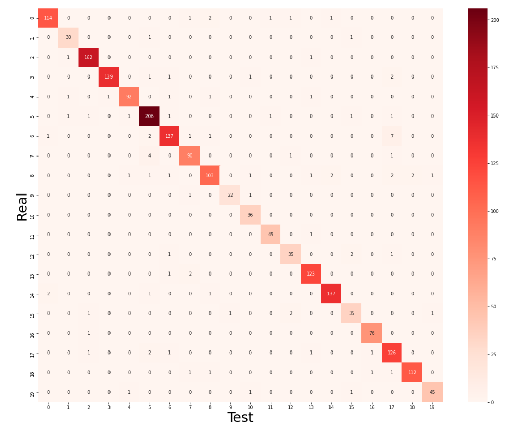
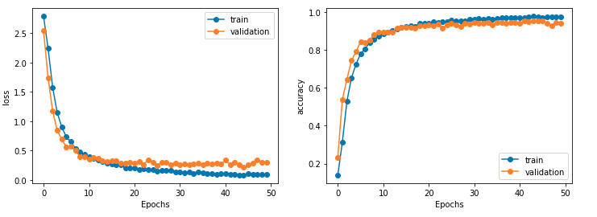
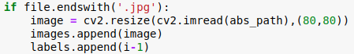
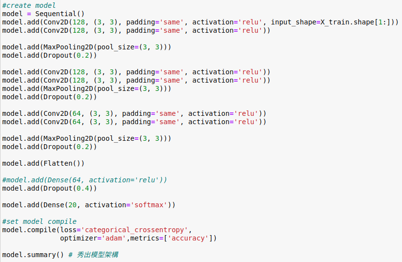
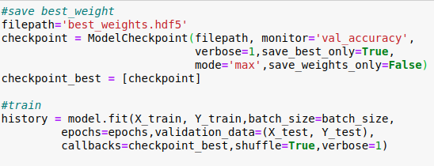
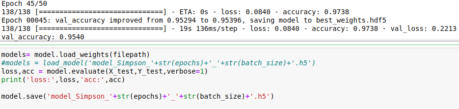

# classification-109368080
# 辛普森圖片辨識
## 1.辛普森圖片辨識使用工具：
### 使用的程式軟體：
  Anaconda  
### 使用的測試檔案：
  machine-learning-ntut-2020-autumn-classification裡面的照片 
## 2.程式方塊圖及作法：
  

## 3.畫圖及結果分析：
   Confusion_Matrix
    
   
   
   Simpson_accuracy  
  
## 4.討論預測值誤差的狀況：
  這次的實驗由於沒有過多的雜訊參雜在測試的資料裡面，因此在一開始是測出來的結果是很不錯的，
  但是在查看調整過後的圖片後發現圖片顯示出來有點模糊，因此在調整圖片方面將64x64的圖片格式轉為80x80，
    
  在調整模型方面，由於原本的參數對現在調整過後的圖片會容易造成overfitting，因此將原本的神經元參數減少
  讓模型在訓練時較不會產生overfitting,而為了拿到更好的訓練結果，加入ModelCheckpoint，它可以擷取訓練過程中較好的模型權重，
  在儲存模型結果時可以將權重導入模型，讓模型辨識的成績可以更加優秀。
  
## 5.修正方案：
### (1).調整圖片的參數
  
### (2).改良訓練模型的參數、層數、優化器
  
  
  

